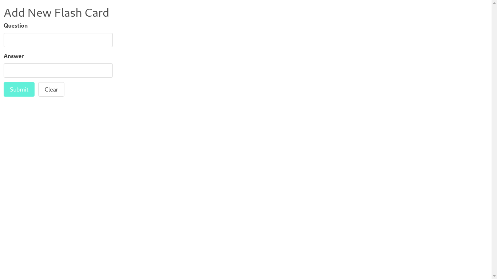

# Angular Flashcard Game

This is a flashcard app where you can add/edit/delete flashcards.

## Demo
Here is a working live demo: [https://lwairore.github.io/angular-flashcard-game/](https://lwairore.github.io/angular-flashcard-game/)

The application looks as follows:

### With no flashcard added

Angular Flashcard Game uses observables in Angular services, `FlashService`, to make it easier to manage the state of the application. I also used immutability to improve performance by using the `OnPush` change detection strategy.

# Built with
- [Angular](https://angular.io/)
- [Bulma](https://bulma.io/)

# Reading resources
- [Bulma](https://bulma.io/) - Bulma is a free, open source CSS framework based on Flexbox and built with Sass. It's 100% responsive, fully modular, and available for free.
- [Angular](https://angular.io/) - Angular is a front-end web framework built by Google. It allows developers to build a single-page applications modeled around a *model-view-controller* (MVC) or *model-view-viewmodel*(MVVM) software architectural pattern. This architecture divides applications into different, but connected parts allowing for parallel development. Following this pattern, Angular splits its different components into the respective parts of a web application. Its components manage the data and logic that pertain to that component, display the data in its respective view, and adapts or controls the view based on the different messages that it receives from the rest of the app.

# Team
[Karangu Lucas Wairore](https://github.com/lwairore)
