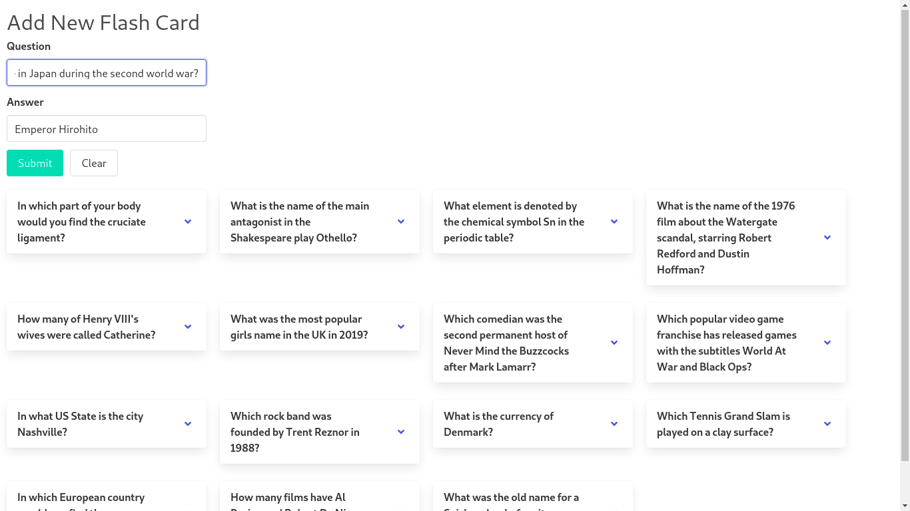

# Angular Flashcard Game

This is a flashcard app where you can add/edit/delete flashcards.

## Demo
The application looks as follows:

Here is a working live demo: [https://lwairore.github.io/angular-flashcard-game/](https://lwairore.github.io/angular-flashcard-game/)

Angular Flashcard Game uses observables in Angular services, `FlashService`, to make it easier to manage the state of the application. I also used immutability to improve performance by using the `OnPush` change detection strategy.
